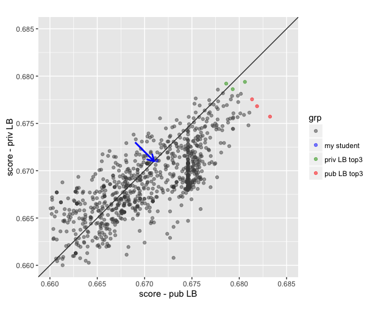

## Sample Data Science Project

Excellent student project by [Laszlo Sallo](https://www.linkedin.com/in/laszlosallo) 
for the [Data Science course](https://github.com/szilard/teach-data-science-msc-analytics-ceu) 
I was teaching at CEU's new MSc in Business Analytics program.

Laszlo has also competed in the 
[Prudential Kaggle competition](https://www.kaggle.com/c/prudential-life-insurance-assessment) 
and **has finished in the top 10% (congratulations!)**. Also notable that he had advanced 400+ places from the public
leaderboard to the private one, 
an excellent sign that he has applied well the techniques we discussed in class that help you avoid *overfitting*.
Many Kaggle competitors including top ones have overfit the public test set and their private LB score ended up lower
than the public one:



(the top 3 kagglers on the public leaderboard /in *red* in the plot above/ have overfit and lost; the competitors in *green* have won).

Some important points from Laszlo's report:
```
This analysis proved some points discussed in the class:
- Coding a data science project is completely different from other coding style. I produced at 
least 10x more code than I present here. Coding here is really a tool the handle to data shape 
it and play with it, then start over.
- H2o is really a handy tool for machine learning, it is easy and intuitive.
- GBM accuracy over Deep Learning and RF in such cases
- Kaggle is good to learn, but it is not the complete picture
```

Click [here to view the full project report](https://cdn.rawgit.com/salacika/prudential-ds-ceu/master/prudential_term.html) 
(an html file generated by Rmarkdown in a reproducible way).


